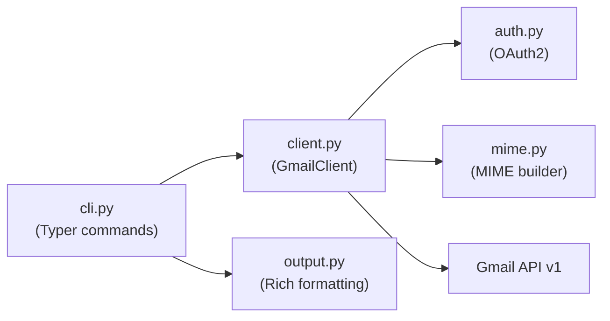

# gmsend — Project Guide

## Overview

`gmsend` is a Python CLI tool for Gmail — send emails with attachments, read messages, and list inbox. Built with Typer + Rich + Google API Python Client.

## Quick Start

```bash
pip install -e .          # Install in dev mode
gmsend --help             # Show commands
gmsend auth               # Authenticate (first time)
gmsend inbox              # List inbox
gmsend read <ID>          # Read a message
gmsend send --to x@y.com --subject "Hi" --body "Hello" --attach file.pdf
```

## Project Structure

```
gmsend/
├── src/gmsend/
│   ├── cli.py           # Typer commands: auth, send, read, inbox
│   ├── client.py        # GmailClient class (API logic)
│   ├── auth.py          # OAuth2 authentication
│   ├── mime.py          # MIME message building (attachments)
│   └── output.py        # Rich console output helpers
├── tests/
├── pyproject.toml
└── CLAUDE.md
```

## Development

```bash
pip install -e ".[dev]"   # Install with dev deps
pytest                    # Run tests
ruff check src/           # Lint
ruff format src/          # Format
```

## Architecture



## Auth

- Client secret: `~/.config/gmsend/client_secret.json`
- Token: `~/.config/gmsend/token.json`
- Scopes: `gmail.modify`
- OAuth flow opens browser on first run

## Conventions

- Python 3.10+, type hints everywhere
- Typer for CLI, Rich for output
- `GmailClient` in `client.py` handles all API calls
- `output.py` handles all display formatting
- Keep commands thin — logic goes in `client.py`
- All public work: no AI/Claude attribution in commits or PRs

## Related

- **gws CLI (Rust):** https://github.com/googleworkspace/cli
  - We filed issue #498 and submitted PR #517 adding `--attachment` to `gws gmail +send`
  - gmsend was the Python workaround while waiting for that PR to merge
